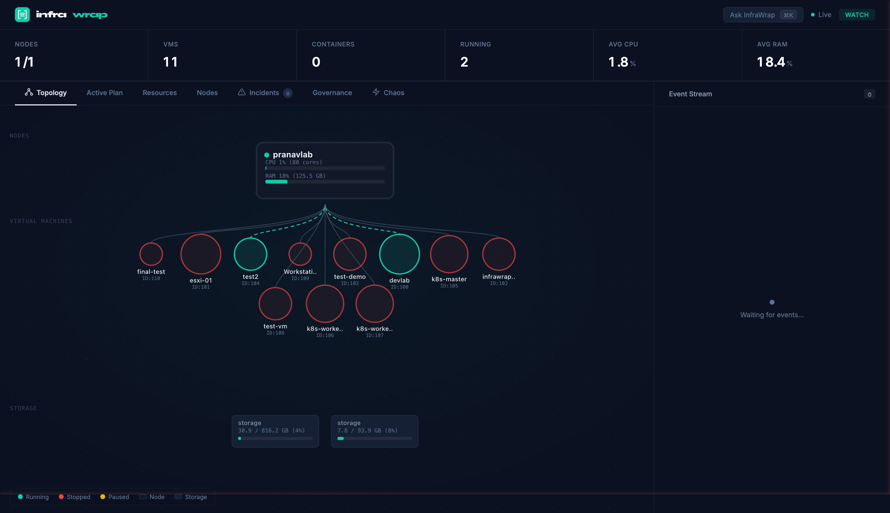
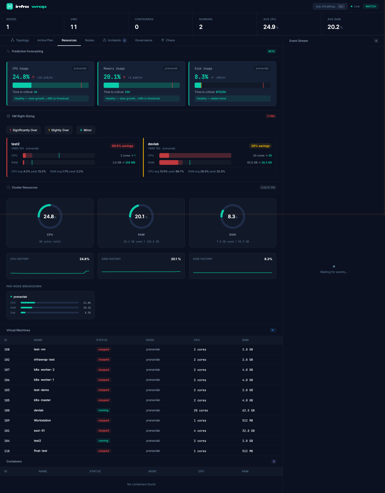
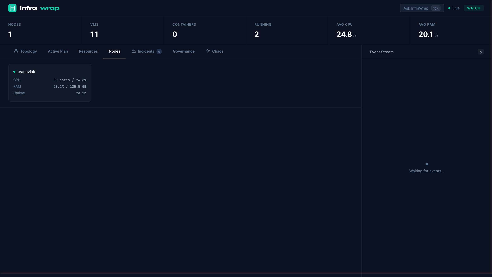
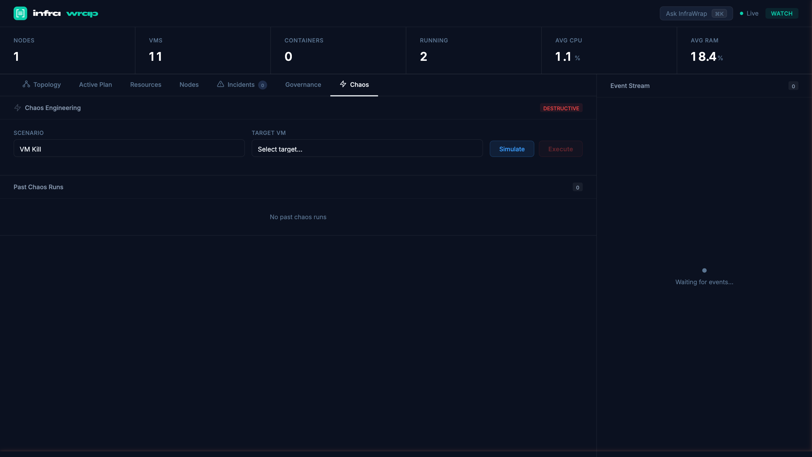

<p align="center">
  <picture>
    <source media="(prefers-color-scheme: dark)" srcset="docs/assets/banner.svg">
    <source media="(prefers-color-scheme: light)" srcset="docs/assets/banner.svg">
    
  </picture>
</p>

<p align="center">
  <strong>An AI-powered infrastructure agent that plans, deploys, monitors, heals, and stress-tests your cluster — autonomously.</strong>
</p>

<p align="center">
  
  
  
  
  
  
</p>

<br/>

<p align="center"><em>Built with help from Claude and Codex.</em></p>

## Why InfraWrap?

Modern infrastructure tools make you choose: **observability** OR **automation** OR **chaos testing**. InfraWrap is all three in one autonomous agent. Describe what you want in plain English, and it plans, executes, monitors, self-heals, and resilience-tests your infrastructure — with governance guardrails at every step.

> Think of it as **vRealize / Aria Operations** meets **ChatGPT** meets **Chaos Monkey** — but open source, running on your own hardware.

---

## Screenshots

<p align="center">
  
  <br/><em>Interactive topology map — nodes, VMs, and storage with live metrics</em>
</p>

<p align="center">
  
  <br/><em>Predictive forecasting, VM right-sizing recommendations, and cluster resource gauges</em>
</p>

<p align="center">
  
  <br/><em>Cmd+K command palette — natural language infrastructure control</em>
</p>

<p align="center">
  
  <br/><em>Chaos engineering — simulate and execute failure scenarios with resilience scoring</em>
</p>

---

## Features

### AI-Powered Natural Language Ops
Describe goals in plain English ("create an Ubuntu VM with 4 cores and 8GB RAM"). The agent generates a dependency-aware execution plan, runs it step-by-step, observes results, and replans on failure.

### Self-Healing Orchestrator
Continuous background monitoring detects anomalies via threshold, trend, spike, and flatline analysis. When something breaks, it matches a playbook, executes remediation, verifies recovery, and resolves the incident — all without human intervention.

### AI Root Cause Analysis
When incidents fire, the LLM analyzes 30 minutes of metrics and recent events to explain *why* the failure happened, not just *what* failed. RCA results stream live to the dashboard.

### Chaos Engineering
Built-in chaos scenarios (VM Kill, Random VM Kill, Multi-VM Kill, Node Drain) with blast radius simulation, predicted vs. actual recovery comparison, and resilience scoring. Test your self-healing before production surprises you.

### Command Palette (Cmd+K)
Spotlight-style overlay for natural language infrastructure control. Type what you want, hit enter — the agent handles the rest.

### VM Right-Sizing
Analyzes CPU and RAM usage history to flag overprovisioned VMs with specific downsizing recommendations. Stop wasting resources.

### Interactive Topology Map
Real-time SVG visualization of your cluster — nodes, VMs, storage — with hover tooltips showing live metrics.

### Five-Tier Governance
Every action is classified by risk (`read` / `safe_write` / `risky_write` / `destructive` / `never`). YAML policy-driven guardrails, circuit breakers, and a persistent SQLite audit trail ensure nothing dangerous happens without approval.

### Multi-Frontend Access
Control your infrastructure from the **web dashboard** (HTTP + SSE), **Telegram bot** (with inline approval buttons), **interactive CLI**, or **MCP server** (for Claude Code integration).

### Predictive Monitoring
Threshold breaches, trend extrapolation via linear regression, spike detection via standard deviation, and flatline detection — all on a configurable poll loop.

---

## Architecture

```
                         +-----------+
                         |   User    |
                         +-----+-----+
                               |
              +----------------+----------------+
              |                |                |
        +-----------+   +-----------+   +-----------+
        | Telegram  |   |    CLI    |   | Dashboard |
        |   Bot     |   |   REPL    |   | (HTTP+SSE)|
        +-----------+   +-----------+   +-----------+
              |                |                |
              +----------------+----------------+
                               |
                       +-------+-------+
                       |  Agent Core   |
                       |  plan / exec  |
                       |  observe /    |
                       |  replan       |
                       +---+---+---+---+
                           |   |   |
              +------------+   |   +------------+
              |                |                |
        +-----------+   +-----------+   +-----------+
        |  Planner  |   | Executor  |   | Observer  |
        | (LLM)     |   |(run tools)|   | (verify)  |
        +-----------+   +-----------+   +-----------+
                               |
                       +-------+-------+
                       | Tool Registry |
                       +---+-------+---+
                           |       |
                    +------+    +--+------+
                    |Proxmox|   | System  |
                    |  API  |   |  Tools  |
                    +-------+   +---------+

  +-----------------+    +-------------------+    +--------------+
  |   Governance    |    |     Healing       |    |  Chaos       |
  | - Classifier    |    |  Orchestrator     |    |  Engine      |
  | - Approval Gate |<-->| - Health Monitor  |<-->| - Simulate   |
  | - Circuit Break |    | - Anomaly Detect  |    | - Execute    |
  | - Audit Log     |    | - Playbook Engine |    | - Score      |
  +-----------------+    | - AI Root Cause   |    +--------------+
                         +-------------------+
```

---

## Self-Healing Loop

The core differentiator. Runs as a continuous background loop:

```
  Detect            Diagnose            Plan              Heal             Verify
+-----------+    +-------------+    +------------+    +------------+    +------------+
|  Health   |--->|  Anomaly    |--->|  Playbook  |--->|   Agent    |--->|  Observer  |
|  Monitor  |    |  Detector   |    |  Engine    |    |   Core     |    |  (post-    |
|  (poll)   |    |  (4 types)  |    |  (match)   |    |  (execute) |    |   check)   |
+-----------+    +-------------+    +------------+    +------------+    +------------+
      ^                                                                      |
      |                          Incident Manager                            |
      +-------------------------(learn + resolve)----------------------------+
```

### Safety Mechanisms

- **Circuit Breaker** — 3 consecutive healing failures pauses all automated healing until manual reset
- **Escalation** — Same anomaly triggering 3+ times within 30 minutes escalates to operator
- **Cooldowns** — Per-playbook cooldown periods (10–360 min) prevent healing loops
- **Approval Gates** — Destructive playbooks require human approval before execution
- **Max Concurrent Heals** — Only 2 simultaneous healing operations to prevent resource contention

---

## Chaos Engineering

Validate your self-healing before production surprises you.

| Scenario | Severity | Description |
|---|---|---|
| **VM Kill** | Medium | Force-stop a specific VM, verify healing restarts it |
| **Random VM Kill** | Medium | Pick a random running VM, stop it, verify auto-recovery |
| **Multi-VM Kill** | High | Stop 2–3 VMs simultaneously, test concurrent healing |
| **Node Drain** | Critical | Stop all VMs on a node, simulate complete node failure |

Each scenario runs through: **Simulate** (predict blast radius) → **Execute** (inject failure) → **Monitor** (track recovery) → **Score** (predicted vs. actual comparison, resilience grade).

Configure `CHAOS_PROTECTED_VMIDS` in `.env` to protect VMs that should never be targeted (e.g., the VM running InfraWrap itself).

---

## Quick Start

### Prerequisites

- Node.js 22+ (18+ minimum)
- Access to a Proxmox VE instance with an API token
- Anthropic API key
- Telegram bot token (optional, for mobile access)

### Install

```bash
git clone https://github.com/patelpa1639/infrawrap.git
cd infrawrap
npm install
```

### Configure

```bash
cp .env.example .env
```

Edit `.env` with your configuration:

```env
# Proxmox VE
PROXMOX_HOST=192.168.1.100
PROXMOX_PORT=8006
PROXMOX_TOKEN_ID=user@realm!tokenname
PROXMOX_TOKEN_SECRET=<your-token-secret>

# AI / LLM
AI_PROVIDER=anthropic
AI_API_KEY=<your-anthropic-api-key>
AI_MODEL=claude-haiku-4-5-20251001

# Telegram (optional)
TELEGRAM_BOT_TOKEN=<your-bot-token>
TELEGRAM_ALLOWED_USERS=<comma-separated-user-ids>

# Dashboard
DASHBOARD_PORT=3000

# Autopilot
AUTOPILOT_ENABLED=false
AUTOPILOT_POLL_INTERVAL_MS=30000

# Chaos Engineering — protect VMs that should never be chaos-targeted
# (e.g., the VM running InfraWrap itself)
CHAOS_PROTECTED_VMIDS=100
```

### Run

```bash
# Full mode — dashboard + telegram + self-healing + autopilot
npm run dev -- full

# Dev mode — CLI + dashboard + telegram + self-healing (best for testing)
npm run dev -- dev

# Interactive CLI only
npm run dev -- cli

# One-shot command
npm run dev -- "create a Ubuntu VM with 2 cores and 4GB RAM"

# Dashboard only
npm run dev -- dashboard

# Telegram bot only
npm run dev -- telegram

# MCP server (for Claude Code integration)
npm run dev -- mcp
```

---

## Governance

Every action is classified by risk and subject to policy controls.

| Tier | Examples | Approval |
|------|----------|----------|
| `read` | List VMs, check status, read logs | Never needed |
| `safe_write` | Start VM, create snapshot | Auto in watch mode |
| `risky_write` | Create VM, modify config, stop VM | Required in build mode |
| `destructive` | Delete VM, delete snapshot, force operations | Always requires explicit confirmation |
| `never` | `delete_all`, `format_storage`, `wipe*` | Agent refuses unconditionally |

Actions are classified from their tool definition, then **elevated** based on parameters: force flags, batch operations on 3+ targets, high resource allocations (>16GB RAM, >500GB disk), and delete flags all push the tier upward.

---

## Default Playbooks

| Playbook | Trigger | Action |
|---|---|---|
| **VM Crashed** | VM status drops from running to stopped | Force-start VM, verify recovery, alert operator |
| **VM Unresponsive** | VM flatlines on heartbeat | Graceful restart, verify network reachability |
| **Node Memory Critical** | Node memory exceeds 90% | Live-migrate lightest VM to least-loaded node |
| **Node CPU Overload** | Node CPU sustained above 90% | Live-migrate heaviest VM to least-loaded node |
| **Disk Space Critical** | Disk usage exceeds 90% | Clean snapshots older than 7 days, expand if needed |
| **Predictive Disk Full** | Trend projects disk full within 48h | Preemptive snapshot cleanup, alert operator |

---

## Tech Stack

| Component | Technology |
|---|---|
| Language | TypeScript (strict mode) |
| Runtime | Node.js 22 |
| AI / LLM | Anthropic Claude (Haiku for cost-efficiency) |
| Infrastructure API | Proxmox VE REST API |
| Telegram | grammY |
| Real-Time Streaming | Server-Sent Events (SSE) |
| Audit Storage | SQLite via better-sqlite3 |
| Schema Validation | Zod |
| MCP Integration | Model Context Protocol SDK |
| Dashboard | React 19 + Vite 6 + Zustand (SSE real-time) |

---

## Project Structure

```
infrawrap/
├── src/
│   ├── index.ts              # Entry point — mode router
│   ├── config.ts             # Environment config loader (Zod validated)
│   ├── types.ts              # Shared type definitions
│   ├── agent/
│   │   ├── core.ts           # Plan → Execute → Observe → Replan loop
│   │   ├── planner.ts        # LLM-powered plan generation + replanning
│   │   ├── executor.ts       # Step execution with governance checks
│   │   ├── observer.ts       # Post-condition verification
│   │   ├── investigator.ts   # Root cause analysis engine
│   │   ├── memory.ts         # Pattern + failure memory (SQLite)
│   │   ├── events.ts         # EventBus (pub/sub + history ring buffer)
│   │   ├── llm.ts            # LLM abstraction (Anthropic / OpenAI)
│   │   └── prompts.ts        # System prompts for each agent role
│   ├── chaos/
│   │   ├── engine.ts         # Chaos engineering — simulate, execute, score
│   │   └── scenarios.ts      # Built-in failure scenarios
│   ├── governance/
│   │   ├── index.ts          # GovernanceEngine — single evaluate() entry point
│   │   ├── classifier.ts     # Action tier classification + param-based elevation
│   │   ├── approval.ts       # Human approval gate (Telegram inline buttons)
│   │   ├── circuit-breaker.ts# Consecutive failure detection + cooldown
│   │   ├── audit.ts          # Persistent SQLite audit log
│   │   └── policy.ts         # YAML policy loader
│   ├── healing/
│   │   ├── orchestrator.ts   # Detect → Diagnose → Heal → Verify + AI RCA
│   │   ├── playbooks.ts      # Playbook engine + 6 default playbooks
│   │   └── incidents.ts      # Incident lifecycle, pattern learning
│   ├── monitoring/
│   │   ├── health.ts         # Metric collection (24h retention)
│   │   └── anomaly.ts        # Threshold, trend, spike, flatline detection
│   ├── autopilot/
│   │   ├── daemon.ts         # Background polling daemon
│   │   └── rules.ts          # Autopilot rule definitions
│   ├── tools/
│   │   ├── registry.ts       # Tool registry + adapter pattern
│   │   ├── proxmox/          # Proxmox VE API adapter
│   │   └── system/           # System tools (SSH, exec, ping)
│   └── frontends/
│       ├── cli.ts            # Interactive REPL + one-shot mode
│       ├── telegram.ts       # Telegram bot with inline approval buttons
│       ├── mcp.ts            # MCP server for Claude Code integration
│       └── dashboard/
│           └── server.ts     # HTTP + SSE server with REST API
├── dashboard/                   # React 19 frontend (Vite + Zustand)
│   ├── src/
│   │   ├── App.tsx              # Main app shell with tab navigation
│   │   ├── components/          # 10 React components (Topology, Resources, etc.)
│   │   ├── hooks/               # SSE, polling, and formatter hooks
│   │   ├── store/               # Zustand global state
│   │   ├── api/                 # REST API client
│   │   └── styles/              # CSS (design tokens, dark theme)
│   └── vite.config.ts           # Vite config with dev proxy
├── policies/
│   └── default.yaml          # Default governance policy
├── docs/
│   └── assets/               # Logo and brand assets
├── package.json
├── tsconfig.json
└── .env.example
```

---

## Roadmap

- [ ] vSphere / vCenter adapter (VMware infrastructure support)
- [ ] Multi-provider support (AWS, Azure via plugin adapters)
- [ ] Persistent dashboard metrics (Prometheus / InfluxDB export)
- [ ] Webhook integrations (Slack, PagerDuty, Discord)
- [ ] Custom playbook authoring via YAML
- [ ] Role-based access control for multi-operator environments

---

## License

MIT

---

<p align="center">
  
  <br/><br/>
  Built by <a href="https://github.com/patelpa1639">Pranav Patel</a>
</p>
